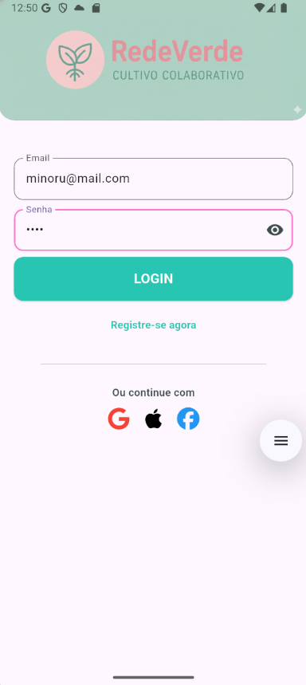

## 🌳 RedeVerde: Mapeamento e Cultivo Colaborativo

O **RedeVerde** é um aplicativo móvel desenvolvido em **Flutter** focado em conectar a comunidade em torno da **jardinagem, permacultura e cultivo colaborativo**. Ele capacita os usuários a mapear e compartilhar locais onde a natureza floresce e fornece ferramentas inteligentes para otimizar o plantio, como um calendário lunar e um assistente virtual de cultivo baseado em IA.

O projeto cumpre integralmente os requisitos técnicos da **UC14 (Desenvolvimento de Aplicativos Flutter)**, incluindo Autenticação, Persistência na Nuvem, Consumo de APIs REST, Integração de Notificações e Uso de Recursos Nativos.

-----

## 📸 Módulos e Visual das Telas

Abaixo estão as principais telas e fluxos de navegação do aplicativo, seguindo a ordem lógica:

### 1\. Autenticação e Acesso

A tela inicial gerencia o acesso do usuário. Utiliza **Autenticação via serviço web (Firebase Auth)**.

| Login | Registro |
| :---: | :---: |
|   |  |

<br>

### 2\. Página Inicial (Home)

Apresenta a proposta de valor do projeto e exibe um carrossel de locais populares na comunidade. Integra dados dinâmicos via **Consumo de API REST**.

| Home Page |
| :---: |
|  |

<br>

### 3\. Assistente Virtual (Chatbot)

Chatbot interativo **alimentado por IA** que responde a dúvidas sobre jardinagem, pragas, solo e técnicas de cultivo. Utiliza **Consumo de API REST** para comunicação.

| Chatbot |
| :---: |
|   |

<br>

### 4\. Mapeamento de Lugares (Cadastro)

Formulário para registrar novos locais, capturando título, notas, **localização exata (GPS)** e uma **foto (Câmera/Galeria)**. Implementa **Persistência de dados no Firebase** e utiliza **Recursos Nativos**.

| Cadastro de Local (Formulário) | Cadastro de Local (Mapa) |
| :---: | :---: |
|  |   |

<br>

### 5\. Calendário Lunar

Ferramenta interativa que calcula a fase da Lua e a estação, fornecendo dicas de cultivo. Integra dados de **previsão do tempo local** via OpenWeatherMap.

| Calendário Lunar |
| :---: |
|  | 

<br>

### 6\. Contato e Notificações

Página dedicada ao contato e onde a lógica de permissão, recebimento de mensagens e histórico de alertas são exibidos. Cumpre o requisito de **Notificações push configuradas**.

| Contato |
| :---: |
|   |

-----

## ✨ Módulos e Funcionalidades

| Módulo | Descrição | Requisitos UC14 Atendidos |
| :--- | :--- | :--- |
| **Login/Registro** | Tela inicial que gerencia o acesso do usuário. | **Autenticação via serviço web (Firebase Auth)** |
| **Página Inicial (`HomePage`)** | Apresenta a proposta de valor do projeto e exibe um carrossel de locais populares na comunidade. | Consumo de API REST (dados dinâmicos) |
| **Mapeamento de Lugares** | Formulário para registrar novos locais, capturando título, notas, **localização exata (GPS)** e uma **foto (Câmera/Galeria)**. Permite persistir, visualizar e compartilhar o histórico de mapeamento. | **Persistência de dados no Firebase**, **Recursos Nativos** |
| **Calendário Lunar** | Ferramenta interativa que calcula a fase da Lua e a estação, fornecendo dicas de cultivo. Integra dados de **previsão do tempo local** via OpenWeatherMap. | **Consumo de API REST** |
| **Assistente Virtual (Chatbot)** | Chatbot interativo **alimentado por IA** que responde a dúvidas sobre jardinagem, pragas, solo e técnicas de cultivo. | **Consumo de API REST** |
| **Central de Notificações** | Exibe o histórico de alertas. Contém a lógica de permissão e recebimento de mensagens via FCM. | **Notificações push configuradas** |

-----

## 📦 Dependências do Projeto

As principais bibliotecas e pacotes utilizados para a funcionalidade e o cumprimento dos requisitos da UC14 são:

| Categoria | Pacote | Finalidade |
| :--- | :--- | :--- |
| **Autenticação e Nuvem** | `firebase_core`, `firebase_auth`, `cloud_firestore` | Gerenciamento de usuários (login/registro) e persistência de locais mapeados. |
| **Notificações** | `firebase_messaging`, `flutter_local_notifications` | Configuração para receber Notificações Push (FCM) e exibir alertas locais. |
| **Serviços Web/APIs** | `http`, `flutter_dotenv` | Requisições de API (Clima e Chatbot) e carregamento seguro de chaves (`.env`). |
| **Recursos Nativos** | `image_picker`, `location`, `geolocator` | Captura de fotos (Câmera/Galeria) e obtenção das coordenadas geográficas (GPS). |
| **Funcionalidades Específicas** | `table_calendar`, `share_plus` | Exibição do Calendário Lunar e compartilhamento de dados. |

-----

## 🎨 Design e Estética (Paleta Pastel e Natureza)

O design utiliza uma paleta de cores suave, natural e de alto contraste, garantindo conforto visual e alinhamento com a temática de jardinagem:

| Nome | Código Hex | Uso Principal |
| :--- | :--- | :--- |
| **Verde Principal** | `0xFF27C5B2` | `AppBar`, Elementos de Fundo em Inputs, Ícones, Destaques Positivos. |
| **Rosa Destaque** | `0xFFFC7ACF` | Botões de Ação (Adicionar, Compartilhar, Sair), Destaques Interativos, Foco em Inputs. |
| **Verde Pastel Claro** | `0xFFE6F7E1` | Fundo principal da aplicação. |
| **Texto Escuro** | `0xFF3C4E4B` | Títulos e corpo de texto. |

-----

## 🛠️ Instruções de Execução

### Pré-requisitos

  * **Flutter SDK:** Versão estável (sdk: ^3.9.2).
  * **Firebase Project:** Projeto configurado com **Authentication**, **Cloud Firestore** e **Cloud Messaging (FCM)**.
  * **APIs de Terceiros:** Chaves de API para OpenWeatherMap e OpenAI/OpenRouter.

### Configuração do Ambiente

1.  **Clone o Repositório:**

    ```bash
    git clone https://cursos.alura.com.br/forum/topico-repositorio-interno-35333
    cd RedeVerde
    ```

2.  **Instale as Dependências:**

    ```bash
    flutter pub get
    ```

3.  **Configuração de Chaves e Assets:**

      * **Firebase Options:** Certifique-se de ter rodado `flutterfire configure` e que o arquivo `firebase_options.dart` esteja na raiz do projeto.

      * **Variáveis de Ambiente (`.env`):** Crie um arquivo chamado **`.env`** na raiz do projeto e adicione suas chaves:

        ```
        # .env
        OPENWEATHER_API_KEY="SUA_CHAVE_OPENWEATHER_AQUI" 
        OPENROUTER_API_KEY="SUA_CHAVE_OPENROUTER_AQUI" 
        ```

      * **Assets:** Garanta que as imagens referenciadas (`assets/img/Atalaiabanner.png`, etc.) existam na pasta `assets/img/`. **NOTA:** As imagens das telas usadas acima (`00_01_login.png`, etc.) devem ser colocadas em um subdiretório, como `assets/docs/`.

4.  **Execute o Aplicativo:**

    ```bash
    flutter run
    ```

-----

## 💾 Download e Instalação do APK

Você pode baixar e instalar a versão mais recente do aplicativo RedeVerde diretamente no seu dispositivo Android:

1.  **Baixe o APK de Release:**
      
      <!-- flutter build apk -->
      <!-- build/app/outputs/flutter-apk/app-release.apk -->

      * [Link para Download do `app-release.apk`](app-release.apk) 
  
      *  QR Code para baixar o APK 
  
             


2.  **Permitir Fontes Desconhecidas:**

      * No seu dispositivo Android, vá em **Configurações \> Segurança/Privacidade** e habilite a opção para **"Instalar aplicativos desconhecidos"** ou **"Fontes Desconhecidas"** para o seu navegador/gerenciador de arquivos.

3.  **Instalação:**

      * Localize o arquivo **`app-release.apk`** que você baixou e toque nele para iniciar a instalação.

-----

## 🤝 Contribuição

Este projeto visa promover a sustentabilidade e a conexão comunitária. Sugestões, *issues* e *pull requests* são bem-vindos\!


